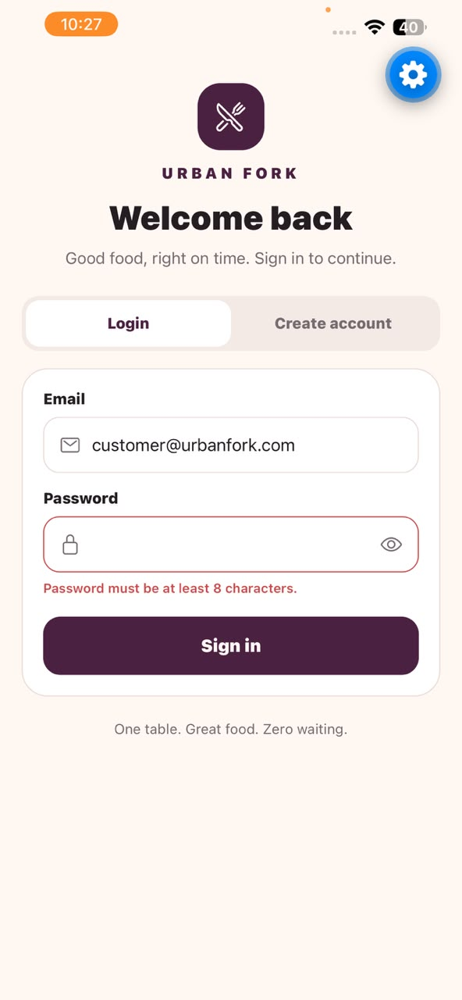

# Urban Fork – Restaurant App MVP

Urban Fork is a frontend-only premium restaurant experience built with React Native, Expo SDK 57, and JavaScript. Customers can discover dishes, search and favourite menu items, build a cart, apply promotions, choose dine-in or takeaway, track live orders, and reserve a table. Managers receive a focused operations dashboard for orders, reservations, and menu availability. Local persistence is provided by AsyncStorage; no backend or external app-data API is used.

## Demo Video

ADD_GOOGLE_DRIVE_VIDEO_LINK_HERE

## Quick Start

### Requirements

- Node.js 20 LTS or newer
- npm
- Expo Go on the iPhone
- iPhone and development computer on the same network

### Installation

```powershell
cd C:\Users\LENOVO\Desktop\MAD1\restaurant-app-mvp
npm install
npx expo start
```

If PowerShell blocks the script shim, use `npm.cmd install` and `npx.cmd expo start`.

Open Expo Go on the iPhone, choose **Scan QR code**, and scan the terminal/browser QR code. Keep both devices on the same Wi-Fi network. If LAN discovery is unavailable, press `s` in the Expo terminal to confirm Expo Go mode and start with `npx.cmd expo start --tunnel`.

## Mock Credentials

| Role | Email | Password |
|---|---|---|
| Customer | `customer@urbanfork.com` | `Urban123` |
| Manager | `manager@urbanfork.com` | `Manager123` |

Signup also supports Customer and Manager roles. New accounts are mock, in-memory accounts for the current app session.

## Feature Summary

- Polished light and dark themes using the Urban Fork aubergine, coral, olive, and warm ivory palette.
- Twenty menu items across exactly Starters, Mains, Desserts, and Drinks, each with a bundled local image.
- Category browsing, 400 ms debounced search, five recent searches, favourites, five sort/view modes, pull-to-refresh, and back-to-top control.
- Immutable cart reducer with quantities, removal, instructions, promo codes, totals, and a live tab badge.
- Receipt-style order summary with service charge, tax, promotional discount, dine-in table selection, and takeaway time selection.
- Persisted order tracking with automatic Pending → Preparing → Ready → Served transitions.
- Reservation availability, hourly slots, party/table matching, confirmation, cancellation, and manager approval.
- Manager controls for order status, reservations, item pricing, availability, and adding menu items.

## App Architecture

```text
SafeAreaProvider
└── ThemeProvider
    └── AuthProvider
        └── RestaurantProvider
            └── OrdersProvider
                └── CartProvider
                    └── AppNavigator
                        ├── Customer bottom tabs + nested stacks
                        └── Manager bottom tabs
```

Each provider has one responsibility. `RestaurantContext` owns shared menu and reservation state, `OrdersContext` owns the order lifecycle, and `CartContext` owns the temporary basket. Persisted providers hydrate before navigation renders, preventing an empty-state flash.

## Folder Structure

```text
restaurant-app-mvp/
├── App.js
├── assets/
│   └── menu/                 # 20 local menu photographs
├── src/
│   ├── components/           # Reusable cards, rows, chips and states
│   ├── context/              # Auth, theme, cart, restaurant and orders
│   ├── data/                 # Menu, users, tables and promo codes
│   ├── hooks/                # useForm, useDebounce, useReservation
│   ├── navigation/           # Role-based tabs and nested stacks
│   ├── reducers/             # Pure cart and orders reducers
│   ├── screens/              # Customer and manager screens
│   └── theme/                # Shared light/dark colour tokens
└── README.md
```

## Hooks Reference

| Screen / Component | Hook | Purpose |
|---|---|---|
| LoginScreen | `useForm` | Controlled values, validation, immediate field-error clearing, submit and reset |
| LoginScreen | `useState` | Login/signup mode, secure-text visibility, and submission state |
| MenuScreen | `useDebounce` | Delays search propagation by exactly 400 ms |
| MenuScreen | `useMemo` | One derived category/search/sort/favourites pipeline |
| MenuScreen | `useRef` | Input focus, FlatList scrolling, previous query, render counter, and timers |
| MenuScreen | `useCallback` | Stable add-to-cart and favourite handlers for memoized cards |
| MenuItemCard | `React.memo` | Skips renders when card props remain unchanged |
| CartContext | `useReducer` | Immutable cart action handling |
| OrderSummaryScreen | `useMemo` | Subtotal, service, tax, discount, and grand total |
| ReservationScreen | `useReservation` | All reservation data, availability, validation, create, and cancel behaviour |
| OrdersContext | `useReducer` | Persisted order creation and guarded status changes |
| OrdersContext | `useEffect` | One-second tracking clock, automatic progression, cleanup, and persistence |
| ThemeContext / AuthContext | `useContext` | App-wide theme and authenticated-user access |

## Customer Flow

1. Sign in with the customer credentials or create a Customer account.
2. Wait for the 1500 ms menu loading state, then browse categories.
3. Search, revisit a recent query, favourite dishes, choose a sort, and add available dishes.
4. Adjust quantity, remove items, add instructions, and apply `URBAN10`, `DINE15`, or `FEAST20`.
5. Review calculated totals and select Dine-in with a table or Takeaway with a pickup time.
6. Place the order and watch it progress at 0, 10, 20, and 30 seconds.
7. Book and cancel reservations from Reserve.
8. Change the theme or sign out from Profile.

## Manager Flow

1. Sign in with the manager credentials.
2. Review the operational summary and Incoming Orders segment.
3. Move active orders between Pending, Preparing, Ready, Served, or Cancelled.
4. Accept or decline pending reservations.
5. Add menu items, edit PKR prices, and toggle availability; customer menu state updates immediately.
6. Change the theme or sign out from Profile.

## Context vs Prop Drilling

Context makes authenticated user, theme, cart, menu, reservations, and orders available to deeply nested screens without passing props through every navigator and intermediate component. It keeps cross-cutting state close to its domain and gives each feature a small custom hook. Prop drilling is still preferable for local, explicit parent-child data such as an individual card callback. A Context value should remain focused and memoized. One drawback is that consumers can re-render whenever the Context value changes, even if they only use part of that value.

## useReducer vs useState

`useReducer` fits the cart because eight named actions update related fields under clear immutable rules. It centralises transitions and makes them easy to review or test. `useState` would scatter quantity, notes, and promotion rules across event handlers. For a single independent value—such as the selected category, search text, or modal visibility—`useState` is simpler and entirely sufficient.

## Cart Reducer Test Matrix

| Action | Initial State | Expected State |
|---|---|---|
| `ADD_ITEM` new | Empty items | Item appended with `quantity: 1` and an empty note |
| `ADD_ITEM` existing | Same item at quantity 1 | Same item at quantity 2; no duplicate row |
| `INCREMENT` | Item at quantity 2 | Item at quantity 3 |
| `DECREMENT` | Item at quantity 2 | Item at quantity 1 |
| `DECREMENT` to zero | Item at quantity 1 | Item removed from `items` |
| `UPDATE_NOTE` | Item with empty note | Only matching item receives the new note |
| `APPLY_PROMO` | No promo | `promoCode` and `discountPercent` set from payload |
| `REMOVE_PROMO` | `DINE15`, 15% | Promo resets to `null` and 0 |
| `CLEAR_CART` | Items and promo present | Exact initial state restored |

## Q4 Dependency-Array Note

If the original Question 4 filtering effect used an empty dependency array, React would run it only after the first render. Later changes to the selected category, search value, sorting choice, favourites, or manager-edited menu would not trigger that effect, so the displayed list would become stale. Adding every dependency could keep it synchronised, but it would still duplicate data that React can derive from existing state. The final implementation therefore replaces that effect and separate `filteredItems` state with one `useMemo` pipeline. Its dependency list names every source value, making updates predictable while avoiding extra state-setting renders and inconsistent copies of the menu.

## When Not to Use useMemo or useCallback

`useMemo` and `useCallback` are performance tools, not correctness tools. Avoid them for trivial calculations, tiny components, or values whose dependencies change on every render; the bookkeeping can cost more than recalculation and makes code harder to read. Do not use them to hide missing dependencies or duplicate state. Measure or identify a concrete stability need first. Urban Fork uses them where list filtering/sorting is meaningful and where stable handlers help the memoized `MenuItemCard`; ordinary event handlers and simple labels remain direct.

## Persistence

AsyncStorage hydrates before protected navigation is displayed and safely falls back if stored JSON is invalid.

| Key | Data |
|---|---|
| `@urbanfork_orders` | Created orders and their latest statuses |
| `@urbanfork_reservations` | Reservation requests and manager decisions |
| `@urbanfork_menu` | Manager-created items, edited prices, and availability |

## Menu Image Assets

All 20 menu items use local PNG files in `assets/menu/`. They are original AI-generated editorial food photographs produced for this project, contain no watermarks or third-party branding, and do not require a network connection. `MenuItemCard` also falls back to the local truffle-fries image if an image fails to render. Manager-created items intentionally use that same bundled house fallback until a dedicated photo is added.

## Screenshots

The following are documentation slots only. Genuine simulator/device captures must be placed at these paths; no screenshot files are fabricated.

| # | Required capture | Preview slot |
|---:|---|---|
| 1 | Login validation |  |
| 2 | Customer login success |  |
| 3 | Signup |  |
| 4 | Menu loading |  |
| 5 | Menu |  |
| 6 | Category filter |  |
| 7 | Search and render counter |  |
| 8 | Cart |  |
| 9 | Promo applied |  |
| 10 | Order summary |  |
| 11 | Order type |  |
| 12 | Order tracking |  |
| 13 | Console before |  |
| 14 | Console after |  |
| 15 | Reservation form |  |
| 16 | Disabled reservation slot |  |
| 17 | Reservation confirmation |  |
| 18 | My reservations |  |
| 19 | Customer profile |  |
| 20 | Dark theme |  |
| 21 | Manager dashboard |  |
| 22 | Manager orders |  |
| 23 | Manager reservations |  |
| 24 | Manager menu management |  |
| 25 | Manager profile |  |

### Screenshot Checklist

- [ ] `screenshots/01-login-validation.jpeg`
- [ ] `screenshots/02-customer-login-success.jpeg`
- [ ] `screenshots/03-signup.jpeg`
- [ ] `screenshots/04-menu-loading.jpeg`
- [ ] `screenshots/05-menu.jpeg`
- [ ] `screenshots/06-category-filter.jpeg`
- [ ] `screenshots/07-search-render-counter.jpeg`
- [ ] `screenshots/08-cart.jpeg`
- [ ] `screenshots/09-promo-applied.jpeg`
- [ ] `screenshots/10-order-summary.jpeg`
- [ ] `screenshots/11-order-type.jpeg`
- [ ] `screenshots/12-order-tracking.jpeg`
- [ ] `screenshots/13-console-before.jpeg`
- [ ] `screenshots/14-console-after.jpeg`
- [ ] `screenshots/15-reservation-form.jpeg`
- [ ] `screenshots/16-disabled-slot.jpeg`
- [ ] `screenshots/17-reservation-confirmation.jpeg`
- [ ] `screenshots/18-my-reservations.jpeg`
- [ ] `screenshots/19-customer-profile.jpeg`
- [ ] `screenshots/20-dark-theme.jpeg`
- [ ] `screenshots/21-manager-dashboard.jpeg`
- [ ] `screenshots/22-manager-orders.jpeg`
- [ ] `screenshots/23-manager-reservations.jpeg`
- [ ] `screenshots/24-manager-menu-management.jpeg`
- [ ] `screenshots/25-manager-profile.jpeg`

The console screenshots must be genuine captures demonstrating the intentional `MenuItemCard rendered:` log before and after observing memoization behaviour.

## Assignment Coverage

- **Q3:** Reusable controlled login/signup form, all validation, exact 1000 ms authentication simulation, roles, mock credentials, loading state, and password controls.
- **Q4:** 20-item local menu, exact 1500 ms initial load, cleanup, error/retry UI, categories, unavailable states, specials, pull-to-refresh, and count title.
- **Q5:** 400 ms custom debounce, input/list refs, recent searches, render counter, empty state, and back-to-top.
- **Q6:** Guarded Auth and Theme contexts, profile, theme switch, logout, and role-gated navigation.
- **Q7:** Pure immutable reducer, instructions, quantities, promos, clear confirmation, totals, and cart badge.
- **Q8:** Memoized receipt calculations, memoized cards, stable handlers, favourites, sort/view modes, and one derived list pipeline.
- **Q9:** Three reusable hooks plus availability-aware, validated, confirm-before-save reservations.
- **Q10:** Persisted order tracking, automatic/manual guarded status changes, manager operations, and shared live menu edits.

## Manual Submission Work

1. Capture the 25 genuine screenshots listed above on an iPhone or iOS simulator.
2. Record the required demo video (three minutes or less).
3. Replace `ADD_GOOGLE_DRIVE_VIDEO_LINK_HERE` with the shareable Google Drive URL.
4. Push the local Git repository to GitHub only if/when a remote is configured.
