# 🍽️ Urban Fork – Restaurant App MVP


Urban Fork is a frontend-only React Native restaurant application built with Expo. It provides separate Customer and Manager experiences for menu browsing, cart management, reservations, order tracking, restaurant operations, and local persistence.

## 🎥 Demo Video

### ▶️ Watch Full App Demo

[Open Urban Fork Demo Video on Google Drive](https://drive.google.com/file/d/19JWpzNvg2EJ85vGqjBb7cAhwE_Q8F0P9/view?usp=drive_link)

The demonstration covers the Customer and Manager workflows, including menu browsing, cart management, reservations, order placement, order tracking, theme switching, and manager operations.

## 📱 App Screenshots

All images below are genuine captures included in the repository.

### Authentication

| Login Validation | Signup |
|---|---|
|  | 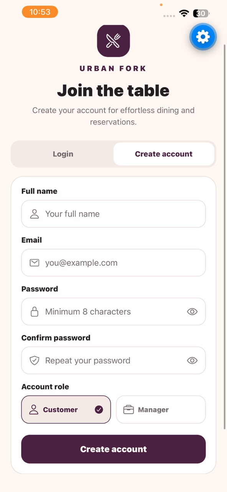 |

### Customer Experience

| Featured Menu | Search Results |
|---|---|
| 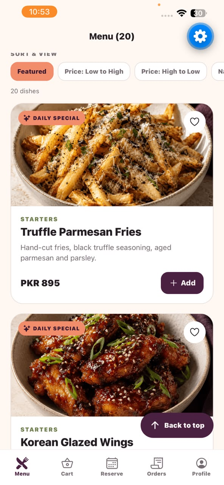 | 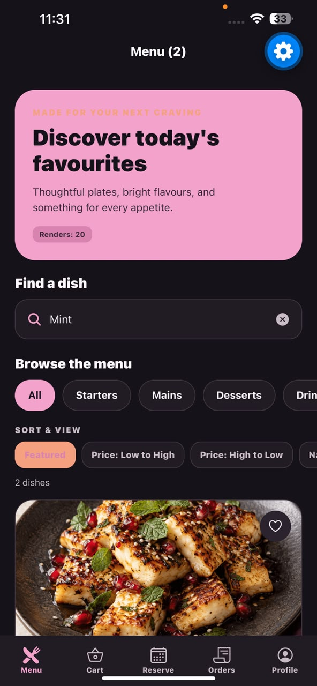 |

| Menu & Render Counter | Price Sorting |
|---|---|
| 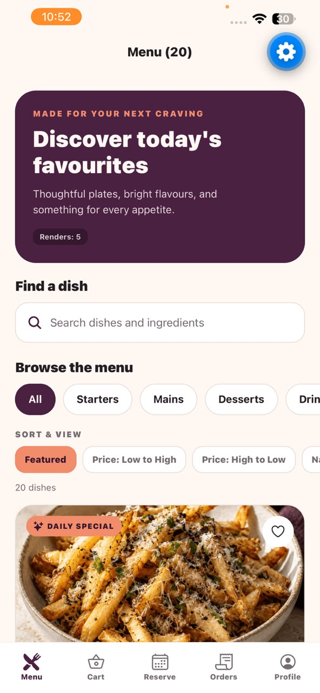 | 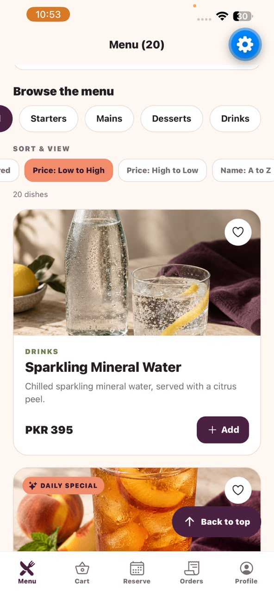 |

| Cart | Dine-in Order Summary |
|---|---|
| 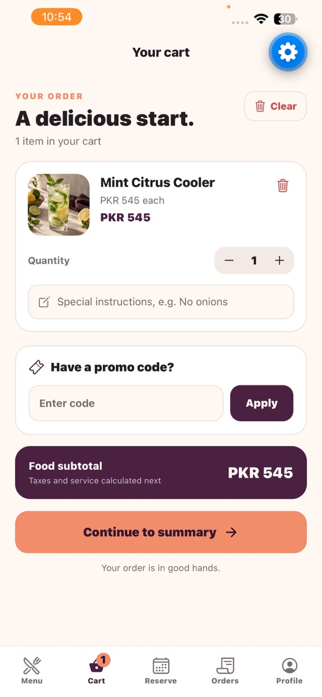 | 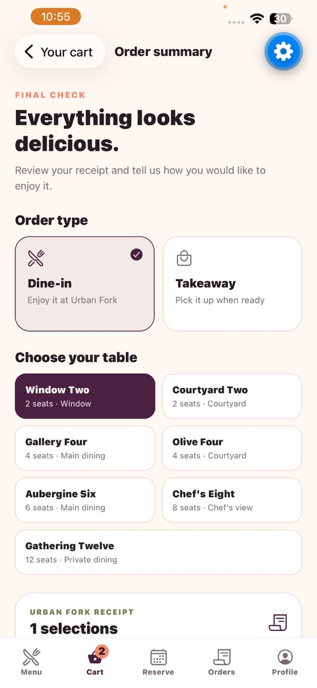 |

| Reservation Time Slots | Order Tracking |
|---|---|
| 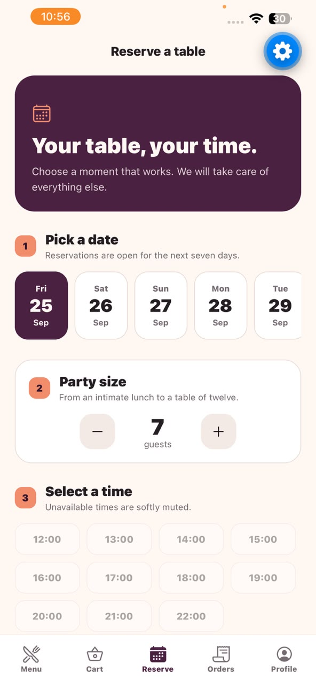 | 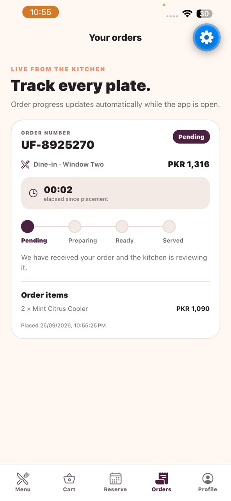 |

| Customer Profile | Reservation Contact & Empty State |
|---|---|
| 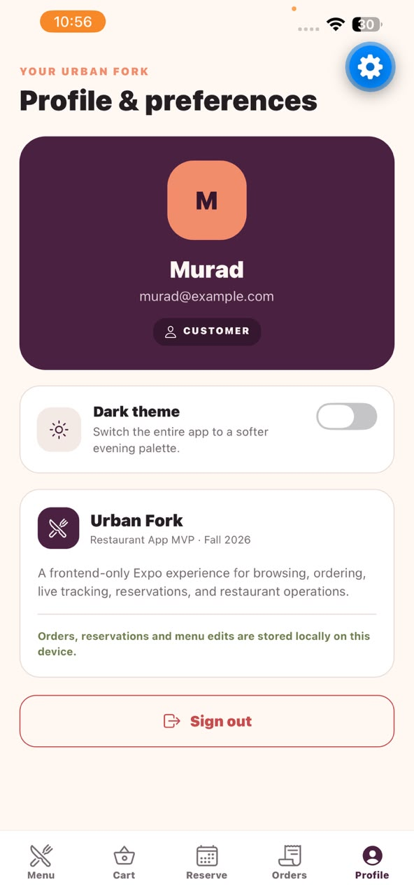 | 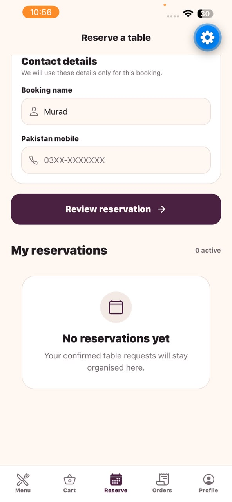 |

| Dark Theme Profile | Dark Theme Search |
|---|---|
| 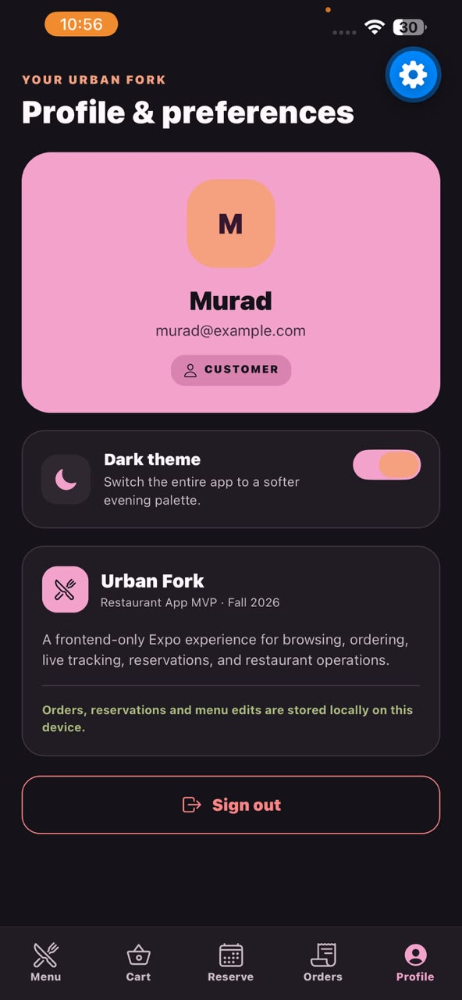 | 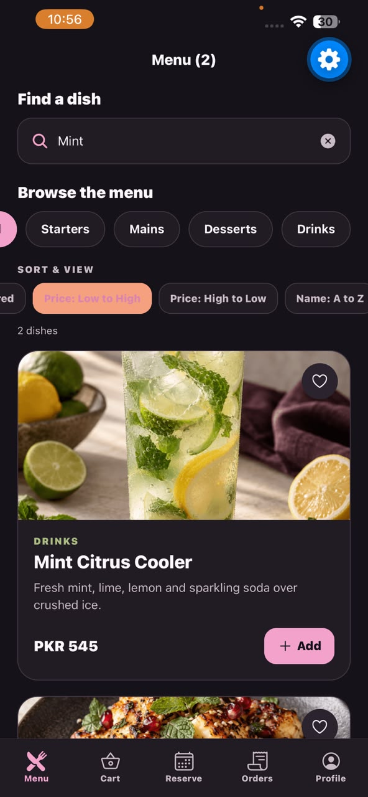 |

### Manager Experience

| Incoming Orders | Reservation Management |
|---|---|
| 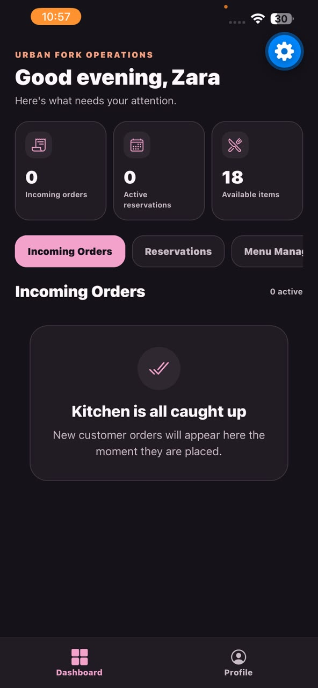 | 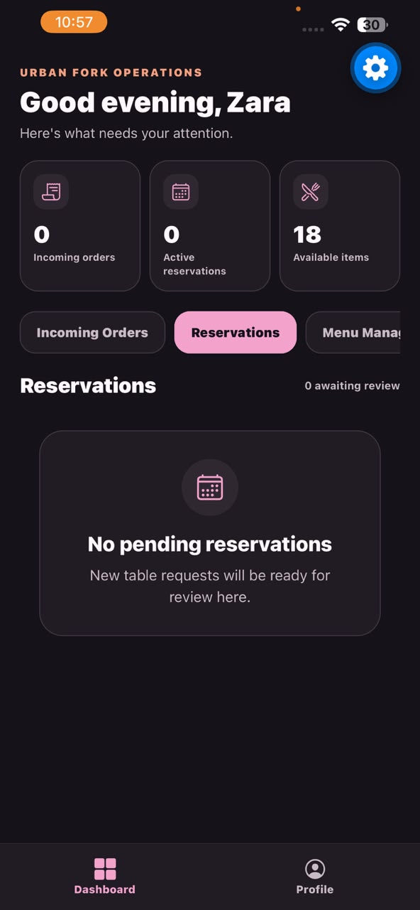 |

| Add Menu Item | Available Menu State |
|---|---|
| 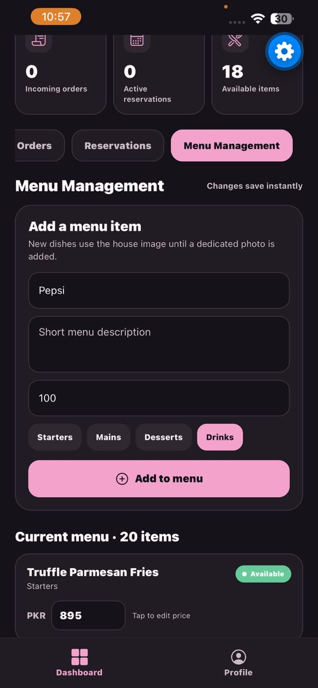 | 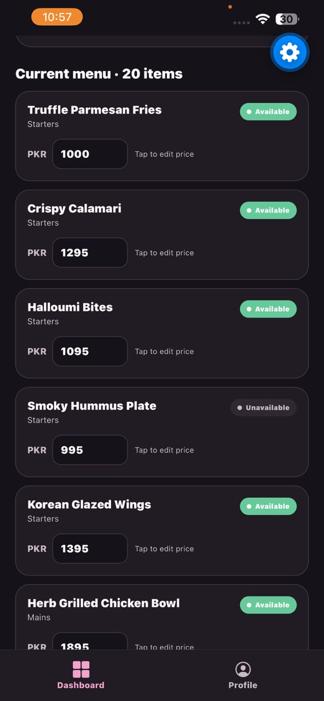 |

| Availability Management | Manager Profile |
|---|---|
| 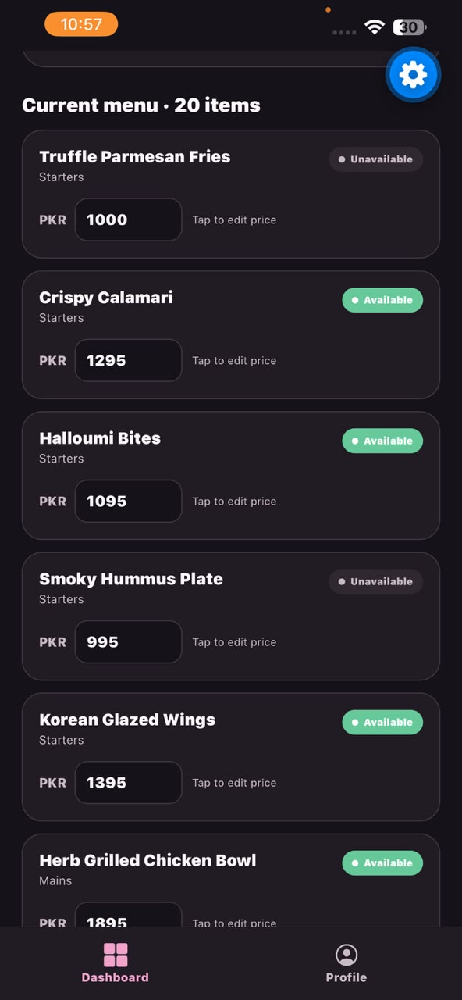 | 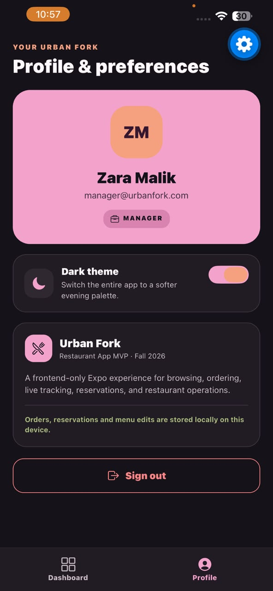 |

### Performance Evidence

| Before Optimization | After Optimization |
|---|---|
| 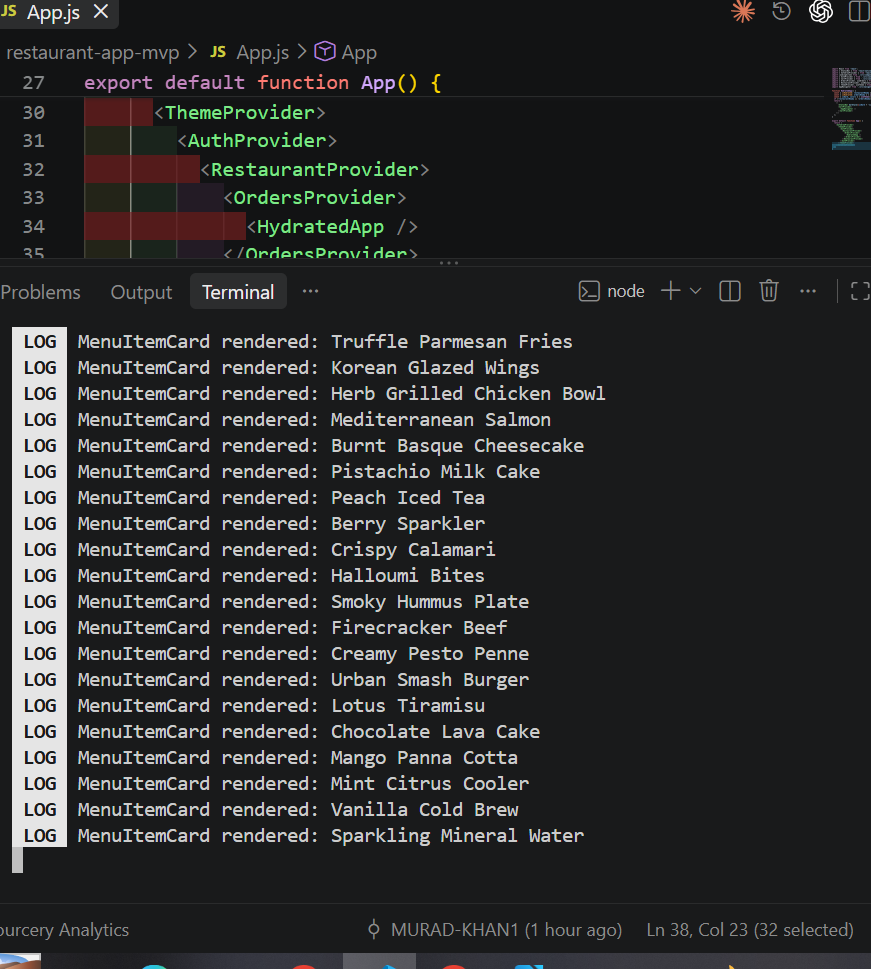 | 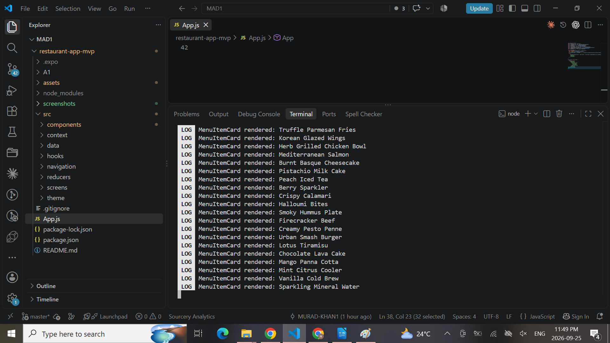 |

## ✨ Key Features

- Customer and Manager authentication with role-based navigation.
- Twenty-item food and drinks menu using unique, optimized local images.
- Category filtering, favourites, sorting, and unavailable-item states.
- Search with an exact 400 ms debounce and the five most recent searches.
- Render evidence plus `React.memo`, `useMemo`, and `useCallback` optimization.
- Cart quantity management, item removal, and special instructions.
- Promo codes: `URBAN10`, `DINE15`, and `FEAST20`.
- Receipt-style order summary with service charge, tax, and discounts.
- Dine-in table selection and Takeaway pickup-time selection.
- Table reservations with party-size matching, disabled time slots, confirmation, and cancellation.
- Live order tracking from Pending to Preparing, Ready, and Served.
- Coherent Dark and Light themes across every screen.
- Manager Dashboard for order, reservation, menu, price, and availability management.
- AsyncStorage persistence for orders, reservations, and menu edits.

## 👤 Demo Accounts

| Role | Email | Password |
|---|---|---|
| Customer | `customer@urbanfork.com` | `Urban123` |
| Manager | `manager@urbanfork.com` | `Manager123` |

Signup can also create an in-memory Customer or Manager account for the current app session.

## 🛠️ Technology Stack

| Technology | Usage |
|---|---|
| React Native 0.86 | Cross-platform mobile interface |
| Expo SDK 57 | Development, bundling, and Expo Go workflow |
| JavaScript | Application language |
| React Navigation | Bottom tabs, nested stacks, and role-based navigation |
| Context API | Shared authentication, theme, menu, order, reservation, and cart state |
| React Hooks | Screen state, effects, refs, memoization, and reusable logic |
| `useReducer` | Immutable cart and order transitions |
| AsyncStorage | Local persistence |
| Ionicons | Consistent interface icons |

No backend, Firebase, external database, or external app-data API is used. The application is frontend-only as required.

## 📂 Project Structure

```text
restaurant-app-mvp/
├── A1/
│   ├── SRS.pdf
│   ├── UML_Diagrams.pdf
│   └── UML/
├── assets/
│   └── menu/
├── screenshots/
├── src/
│   ├── components/
│   ├── context/
│   ├── data/
│   ├── hooks/
│   ├── navigation/
│   ├── reducers/
│   ├── screens/
│   └── theme/
├── App.js
└── README.md
```

### Application Architecture

```text
SafeAreaProvider
└── ThemeProvider
    └── AuthProvider
        └── RestaurantProvider
            └── OrdersProvider
                └── CartProvider
                    └── AppNavigator
                        ├── Customer tabs + nested stacks
                        └── Manager tabs
```

The providers remain focused: authentication and theming are independent, restaurant state owns menu and reservations, order state owns tracking, and cart state owns the current basket. Persisted providers hydrate before protected navigation renders, preventing empty-state flashes and circular dependencies.

## 🚀 Installation & Running

### 1. Clone the repository

```bash
git clone https://github.com/noorifatima310669/restaurant-app-mvp.git
```

### 2. Enter the project

```bash
cd restaurant-app-mvp
```

### 3. Install dependencies

```bash
npm install
```

### 4. Start Expo

```bash
npx expo start
```

On Windows PowerShell, use the command shims if npm or npx scripts are blocked:

```powershell
npm.cmd install
npx.cmd expo start
```

### 5. Open on iPhone or Android

Install Expo Go, keep the phone and development computer on the same network, and scan the Expo QR code. Use the same Expo account on the development machine and Expo Go if authentication is requested.

## 🪝 Hooks Used

| Hook / Technique | Screen or Feature | Purpose |
|---|---|---|
| `useState` | Login, Menu, Order Summary, Manager Dashboard | Controlled inputs, selections, loading, modal, and interface state |
| `useEffect` | Menu, providers, order tracking | Timed loading, persistence hydration, storage updates, and interval cleanup |
| `useRef` | MenuScreen | Search focus, FlatList scrolling, previous query, render count, and timer references |
| `useContext` | All screens through custom context hooks | Accesses authentication, theme, cart, restaurant, and order state |
| `useReducer` | CartContext, OrdersContext | Applies predictable immutable state transitions |
| `useMemo` | MenuScreen, OrderSummaryScreen, providers | Derives filtered menu data, receipt totals, counts, and stable context values |
| `useCallback` | MenuScreen and providers | Stabilizes add-to-cart, favourite, render, and provider action functions |
| `React.memo` | MenuItemCard | Avoids card renders when its props are unchanged |
| `useForm` | LoginScreen | Reusable controlled values, validation, submission, reset, and validity |
| `useDebounce` | MenuScreen | Delays search propagation by exactly 400 ms |
| `useReservation` | ReservationScreen | Owns availability, validation, contact, create, and cancellation logic |

## 🧠 Context API vs Prop Drilling

Context shares authentication, theme, cart, menu, reservation, and order state across deeply nested screens.<br>
It avoids passing the same values through navigators and intermediate components that do not use them.<br>
Focused custom hooks such as `useAuth` and `useTheme` keep consumption clear and guarded.<br>
Direct props remain appropriate for local parent-child data, such as a card action callback.<br>
Provider values are memoized and separated by domain to limit unnecessary updates.<br>
A drawback is that consumers can re-render whenever their Context value changes.

## 🛒 useReducer vs useState

`useReducer` suits the cart because eight named actions update related fields under explicit immutable rules.<br>
It centralizes quantity, note, removal, clearing, and promotion transitions in one pure function.<br>
This makes complex transitions easier to inspect and test than scattered setter calls.<br>
`useState` is enough for a single independent value such as search text, selected category, or modal visibility.

## 🧪 Cart Reducer Test Cases

| Action | Initial State | Expected State |
|---|---|---|
| `ADD_ITEM` new | Empty items | Item added with `quantity: 1` and an empty note |
| `ADD_ITEM` existing | Matching item at quantity 1 | Matching item becomes quantity 2 without a duplicate row |
| `INCREMENT` | Matching item at quantity 2 | Matching item becomes quantity 3 |
| `DECREMENT` | Matching item at quantity 2 | Matching item becomes quantity 1 |
| `DECREMENT` to zero | Matching item at quantity 1 | Matching item is removed |
| `REMOVE_ITEM` | Multiple items | Only the matching item is removed |
| `UPDATE_NOTE` | Item with an empty note | Only the matching item receives the instruction |
| `APPLY_PROMO` | No promotion | `promoCode` and `discountPercent` are set |
| `REMOVE_PROMO` | `DINE15` at 15% | Promotion resets to `null` and 0 |
| `CLEAR_CART` | Items and promotion present | Exact initial cart state is restored |

## 🔄 useEffect Dependency Note

If the original Question 4 filtering effect used an empty dependency array, React would run it only after the first render. Later changes to the selected category, search value, sorting choice, favourites, or manager-edited menu would not trigger that effect, so the displayed list would become stale. Adding every dependency could keep it synchronized, but it would still duplicate data that React can derive from existing state. The final implementation therefore replaces that effect and separate `filteredItems` state with one `useMemo` pipeline. Its dependency list names every source value, making updates predictable while avoiding extra state-setting renders and inconsistent menu copies.

## ⚡ Performance Optimization

`MenuItemCard` uses `React.memo` so unchanged cards can skip renders. MenuScreen passes stable add-to-cart and favourite handlers through `useCallback`, and its `renderItem` callback is memoized as well. Category filtering, debounced search, sorting, and favourites are combined in one `useMemo` pipeline instead of duplicated state. Order Summary also memoizes receipt calculations. These tools are not used for trivial values or as substitutes for correct dependencies; unnecessary memoization can add complexity and cost more than recalculation. The genuine console evidence is shown in [Before Optimization](screenshots/13-console-before.png) and [After Optimization](screenshots/14-console-after.png).

## 💾 Local Persistence

AsyncStorage loads saved data before protected navigation appears and safely handles invalid stored JSON.

| Storage Key | Persisted Data |
|---|---|
| `@urbanfork_orders` | Orders and their latest tracking status |
| `@urbanfork_reservations` | Reservation requests and manager decisions |
| `@urbanfork_menu` | Added items, price changes, and availability edits |

Authentication and the active cart remain session state. Menu images are bundled locally through explicit static `require(...)` mappings.

## 👥 User Roles

### Customer

Customers can sign in or create an account, browse and search the menu, sort and favourite dishes, manage a cart, apply promotions, choose Dine-in or Takeaway, place and track orders, reserve tables, change themes, and sign out.

### Manager

Managers receive a dedicated dashboard for incoming orders, reservation decisions, menu-item creation, price editing, and availability control. Manager navigation is role-gated and excludes customer-only tabs.

## 🎬 Complete Demo Flow

**Customer**

Login/Signup → Browse Menu → Search/Sort → Add to Cart → Apply Promo → Order Summary → Dine-in/Takeaway → Place Order → Track Order → Reserve Table → Profile/Theme

**Manager**

Login → Dashboard → Incoming Orders → Reservation Management → Menu Management → Availability Management → Profile/Theme

---

**Urban Fork – Restaurant App MVP**<br>
**Fall 2026**<br>
Built with React Native & Expo.
